# WORK.md - Полный пошаговый гайд выполнения лабораторной (Arch Linux + VS Code)

> Документ оформлен как воспроизводимая инструкция для студента/человека/ребенка/животного и как технический отчёт «как это было сделано» для преподавателя.

---

## 1. Цель и границы работы

### Что реализуем
- Только **Задачу Команды 1 (Сценарий “Безопасность”)**:
  - изоляция гостевой сети от рабочей;
  - управление правилами через ONOS REST API;
  - демонстрация через Mininet (`ping`, при желании `iperf`).

### Что не реализуем
- **Команда 2 (QoS/VoIP/DSCP)** намеренно не включена, чтобы строго соблюдать условие задания.

---

## 2. Минимальные требования к ноутбуку

- ОС: **Arch Linux** (актуальный rolling release).
- IDE: **VS Code**.
- Права `sudo`.
- Стабильное интернет-соединение.
- Рекомендуемая RAM: 8+ ГБ (у меня 16)

---

## 3. Подготовка среды на Arch Linux

### 3.1 Обновить систему

```bash
sudo pacman -Syu
```

### 3.2 Установить базовые пакеты

```bash
sudo pacman -S --needed \
  git curl wget jq \
  python python-pip python-virtualenv \
  mininet openvswitch \
  jdk17-openjdk
```

> Если `onos` отсутствует в официальных репозиториях, используйте контейнерный запуск ONOS (см. раздел 4.2).

### 3.3 Включить Open vSwitch

```bash
sudo systemctl enable --now ovs-vswitchd.service 
sudo systemctl status ovs-vswitchd --no-pager
```

Ожидаемый результат: сервис активен (`active (running)`).

---

## 4. Развёртывание ONOS

Выберите **один** из режимов.

## 4.1 Вариант A (нативно)

Если ONOS уже установлен локально:

1. Запустите ONOS согласно вашей установке.
2. Убедитесь, что REST API отвечает:

```bash
curl -u onos:rocks http://127.0.0.1:8181/onos/v1/devices
```
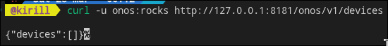

Если видите JSON-ответ - все норм.

## 4.2 Вариант B (рекомендуется для Arch): Docker/Podman

### Docker

```bash
sudo pacman -S --needed docker
sudo systemctl enable --now docker
sudo docker run -d --name onos \
  -p 6653:6653 -p 8181:8181 \
  onosproject/onos:latest
```

Проверка:

```bash
curl -u onos:rocks http://127.0.0.1:8181/onos/v1/devices
```
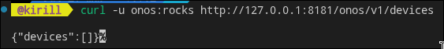

> Первый старт контейнера занимает несколько минут.

---

## 5. Подготовка проекта в VS Code

### 5.1 Клонировать репозиторий

```bash
git clone https://github.com/sma1kyyy/sdn-smart-routing-agrotex.git
cd sdn-smart-routing-agrotex
```

### 5.2 Открыть в VS Code

```bash
code .
```

### 5.3 Создать Python-окружение

```bash
python -m venv .venv
source .venv/bin/activate
pip install -r requirements.txt
```

---

## 6. Запуск топологии Mininet

### 6.1 Очистить старые остатки Mininet

```bash
sudo mn -c
```

### 6.2 Запустить топологию AgroTex

```bash
sudo -E python src/topology/agrotex_topology.py
```

Почему `-E`: позволяет сохранить переменные окружения активированного `.venv`.

### 6.3 Проверить базовую связность (до политики)

Внутри Mininet CLI:

```bash
mininet> pingallfull
mininet> pingall
```
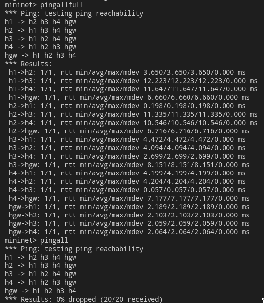

На этом этапе возможна частичная связность в зависимости от активных ONOS-приложений.

---

## 7. Применение политики безопасности через REST API

Откройте второй терминал в корне проекта и активируйте `.venv`:

```bash
source .venv/bin/activate
python src/controller/guest_isolation.py apply
```

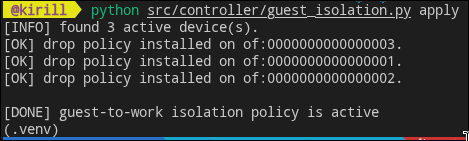

Ожидаемо:
- скрипт найдёт активные девайсы в ONOS;
- на каждый девайс установит flow-rule с `priority=50000`;
- правило заблокирует Guest (`10.0.2.0/24`) → Work (`10.0.1.0/24`).

---

## 8. Тестирование

### 8.1 Проверка блокировки

В Mininet CLI:

```bash
mininet> h3 ping -c 3 h1
mininet> h4 ping -c 3 h2
```

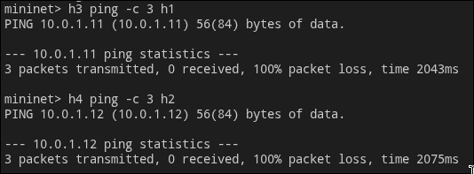

Ожидаемо: 100% packet loss.

### 8.2 Проверка разрешенного доступа к gateway

```bash
mininet> h3 ping -c 3 hgw
mininet> h4 ping -c 3 hgw
```

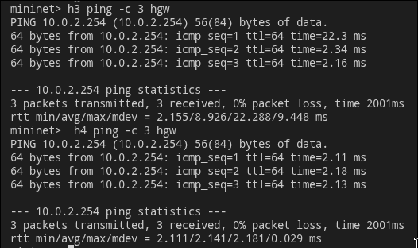

Ожидаемо: ответы есть.

### 8.3 Проверка внутри рабочего сегмента

```bash
mininet> h1 ping -c 3 h2
```

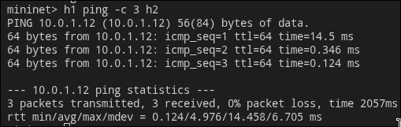

Ожидаемо: ответы есть.

### 8.4 (Опционально) iperf

```bash
mininet> h1 iperf -s &
mininet> h3 iperf -c h1 -t 5
```

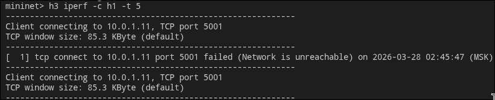

Ожидаемо: соединение не устанавливается после применения политики.

---

## 9. Проверка на стороне ONOS

Смотреть устройства:

```bash
curl -u onos:rocks http://127.0.0.1:8181/onos/v1/devices | jq
```

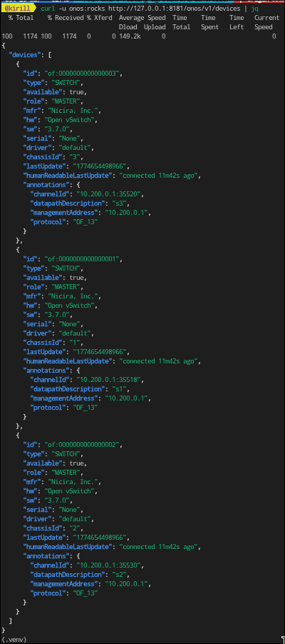

Смотреть потоки конкретного девайса:

```bash
curl -u onos:rocks http://127.0.0.1:8181/onos/v1/flows/of:0000000000000001 | jq
```

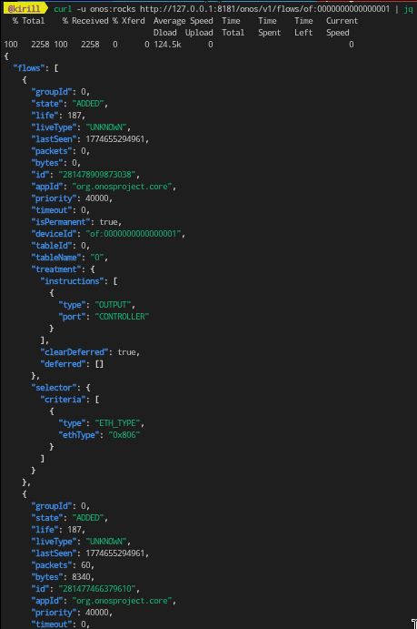

Ищите критерии:
- `IPV4_SRC = 10.0.2.0/24`
- `IPV4_DST = 10.0.1.0/24`
- высокий `priority`

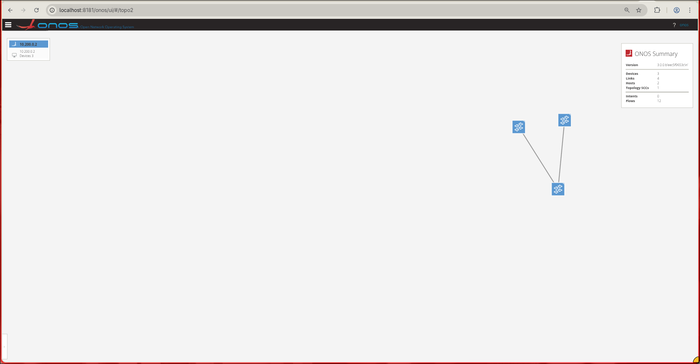

---

## 10. Снятие политики и обратная проверка

```bash
source .venv/bin/activate
python src/controller/guest_isolation.py remove
```

Далее в Mininet:

```bash
mininet> h3 ping -c 3 h1
```

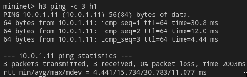

Ожидаемо: связность возвращается (при наличии корректных forwarding-правил ONOS).

---

## 11. Автоматическая проверка проекта

```bash
./scripts/run_policy_checks.sh
```

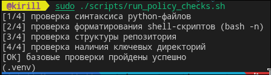

Скрипт проверяет:
- синтаксис Python файлов;
- корректность shell-скрипта;
- наличие ключевых markdown-файлов;
- наличие нужной структуры директорий.

---

## 12. Частые проблемы и решения

### Проблема: ONOS не видит свитчи
- Проверьте, что Mininet запускается с `RemoteController` на `127.0.0.1:6653`.
- Проверьте публикацию порта 6653 (если ONOS в контейнере).

### Проблема: `401 Unauthorized` при REST-запросе
- Убедитесь, что используете `onos:rocks`.
- Проверьте URL `http://127.0.0.1:8181`.

### Проблема: Политика не сработала
- Убедитесь, что указаны верные подсети `guest/work`.
- Проверьте приоритет (`50000`) — должен быть выше реактивных потоков.
- Убедитесь, что правило установлено на все активные устройства.

### Проблема: Mininet «завис» после экспериментов

```bash
sudo mn -c
sudo systemctl restart openvswitch
```

---

## 13. Что сдаем

1. Репозиторий с кодом, README, WORK.md, DESCRIPTION.md.
2. Короткое видео/демо/преза 5–7 минут.
3. Скриншоты/логи:
   - до применения политики;
   - после применения;
   - вывод ONOS REST по flows.
4. Краткие выводы по безопасности сегментации в SDN.

---

## 14. Чек-лист готовности к защите

- [ ] ONOS и Mininet запускаются без ошибок.
- [ ] Топология поднимается стабильно.
- [ ] `apply` блокирует Guest → Work.
- [ ] Guest → Gateway работает.
- [ ] `remove` снимает блокировку.
- [ ] Все команды и результаты зафиксированы в заметках для демонстрации.

Если все пункты отмечены - лабораторная работа в хорошем состоянии для сдачи. //позже исправлю пометки
